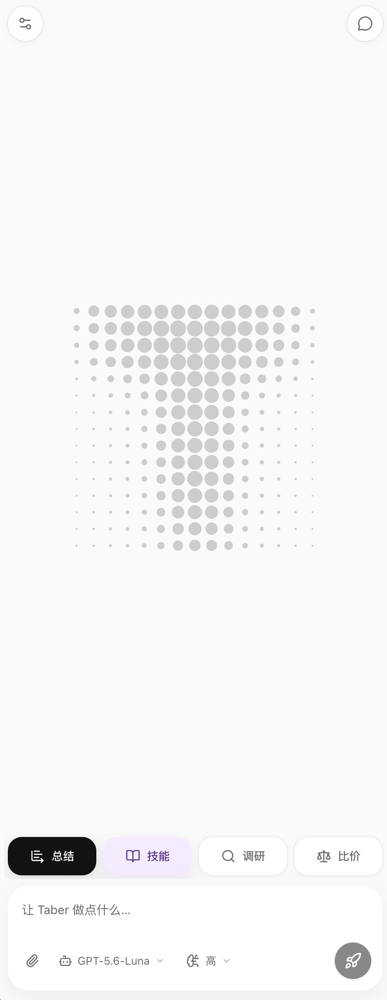
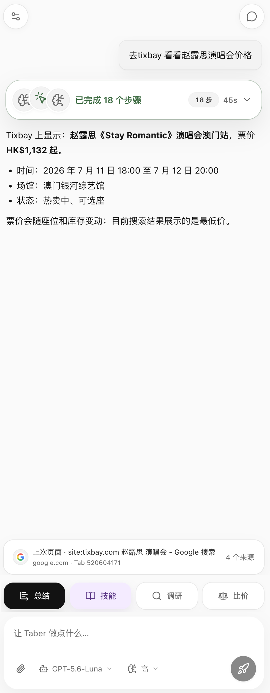
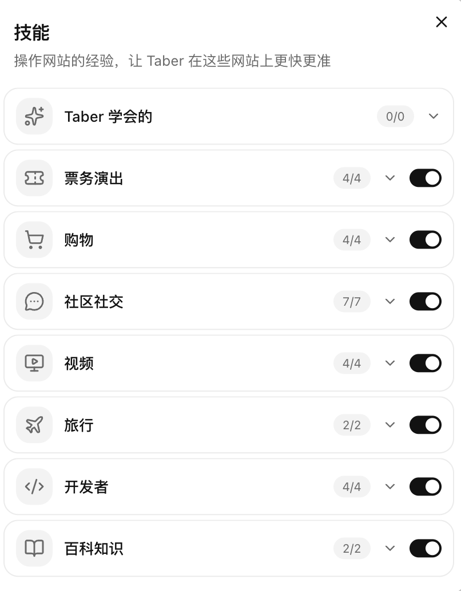

<p align="center">
  
</p>

<h1 align="center">Taber</h1>

<p align="center">
  <strong>会动手的浏览器 Agent，长在 Chrome / Edge 侧边栏里。<br>
  读页面、点按钮、填表单、跨页收集、读写文档，越用越懂你常去的网站。</strong><br>
  A browser agent that acts, living in your Chrome / Edge side panel.<br>
  Reads pages, clicks, fills forms, collects across tabs, works with documents, and learns your sites.
</p>

<p align="center">
  <a href="#english">🇺🇸 English</a> · <a href="#中文">🇨🇳 中文</a>
</p>

<p align="center">
  <a href="LICENSE"></a>
  <a href="https://github.com/Suge8/taber/releases"></a>
</p>

<p align="center">
  <a href="docs/assets/readme/empty-state.webp"></a>
  &nbsp;
  <a href="docs/assets/readme/task-result.webp"></a>
</p>
<p align="center"><sub>空闲侧边栏与任务结果 · Idle side panel and completed task</sub></p>

<p align="center">
  <a href="docs/assets/readme/site-skills.webp"></a>
</p>
<p align="center"><sub>按场景管理的站点技能 · Site skills grouped by workflow</sub></p>

---

## 中文

浏览器里的 AI 插件，大多只会聊：

1. 让它填个表单，它回你一段操作教程，字段还是你自己填
2. 只能读当前这一页；收集十个网页的数据，你得一个个点开喂给它
3. 丢给它一个 PDF 让它整理成 Word，做不到
4. 昨天带它跑通了一个网站的流程，今天再来，它从零开始摸

Taber 直接操作你的浏览器：任务发出去，它自己读页面、点按钮、填表单、开新标签、抓取数据、生成文档，跑通的站点流程存成技能，下次直接用。全程在你本机，用你已登录的账号。

### 对比

| | Taber | 聊天类侧边栏插件 | 云端 Browser Agent |
|---|---|---|---|
| 操作页面 | ✅ 点击 / 填表 / 跨标签 | ❌ 只读只聊 | ✅ |
| 登录态 | ✅ 直接用你已登录的账号 | — | ❌ 云端浏览器要重新登录 |
| 直读公开 URL | ✅ 不开标签页，可并行 | ❌ | 部分 |
| 文档进出 | ✅ 上传 PDF/Word，产出 Word / 导出 PDF | ❌ | ❌ |
| 站点经验 | ✅ 技能沉淀本地，越用越熟 | ❌ | ❌ |
| 模型 | ✅ 自带 API key 或订阅复用 | ❌ 绑定厂商 | ❌ 绑定厂商 |
| 数据去向 | ✅ 只发给你选的模型 | 经厂商服务器 | 全部经云端 |

### 亮点

- **6 个固定工具** — 读文档、取图、导航、页面操作、REPL、文件系统。边界收紧，行为可预期，每一步都有工具轨迹可查。
- **fetch-first** — 公开网页和 PDF 不开标签页直接读，跨页收集从逐个点开变成并行抓取。
- **文档工作流** — 上传 PDF / Word / 文本让它处理；产出 Markdown / HTML / CSV / Word，侧边栏一键下载，Markdown 直接打印导出 PDF。
- **站点技能** — 跑通的流程、踩过的坑存成技能文件，下次进同一个网站先读技能再动手；内置 HN、Reddit、GitHub、Wikipedia、Stack Exchange、npm、PyPI、arXiv 共 8 条 API 捷径。
- **模型自由** — OpenAI API key、OpenAI-compatible 端点、ChatGPT/Codex 订阅登录、xAI/Grok 订阅登录，四种接法任选。
- **本地与低权限** — 会话、凭证、文件、技能全部存在扩展数据库；发布版不带 `debugger` 权限，不读 cookie。

### 安装

1. 在最新 [GitHub Release](../../releases) 下载 `taber-*-chrome-mv3.zip` 并解压。
2. 打开 `chrome://extensions`，开启 **开发者模式**。
3. 点击 **加载已解压的扩展程序**，选择含 `manifest.json` 的文件夹。
4. 侧边栏打开 Taber。默认建议快捷键：Windows/Linux/ChromeOS 为 `Ctrl+Shift+Y`，macOS 为 `Command+Shift+Y`；实际绑定以 `chrome://extensions/shortcuts` 为准。

### 开始使用

在设置里接一个模型（API key 或订阅登录），按提示完成站点访问授权，然后直接下任务：

```text
总结这个页面，存成 summary.md
提取价格表，对比这三个标签页里的套餐
把我上传的这份 PDF 整理成 Word 报告
去 HN 抓今天前 10 条，给我标题和链接
找到注册表单，填好基础字段，提交前停下让我确认
```

### 隐私与权限

- 发布版不请求 `debugger`，不读取 cookie。
- 模型凭证保存在 IndexedDB，只用于调用你选择的供应商。
- 为完成任务，页面内容、截图、文档、提示词和工具结果会发给你选择的模型供应商，除此之外不出本机。
- `browserjs` 页面脚本只在你授权后运行。

漏洞报告见 [`SECURITY.md`](SECURITY.md)。

<details>
<summary>高级：源码构建、开发、测试</summary>

#### 环境要求

- Node.js `>= 22.19`
- pnpm `>= 10.23`
- Chrome 或 Edge `>= 135`

#### 从源码构建

```bash
git clone https://github.com/Suge8/taber.git
cd Taber
pnpm install
pnpm build:chrome   # 产出 .output/chrome-mv3
pnpm build:edge     # 产出 .output/edge-mv3
```

在 `chrome://extensions` / `edge://extensions` 加载对应目录。

#### 开发与调试

```bash
pnpm dev            # 开发模式
pnpm dev:debug      # 本地 debugger 构建（含调试工具）
```

#### 打包与验证

```bash
pnpm run zip:chrome        # 打 Release zip 并校验 manifest
pnpm run test:unit         # 单元测试
pnpm run test:e2e          # 确定性 E2E 场景
pnpm run test:ci           # 完整 CI：双浏览器构建 + 校验 + 全部测试
pnpm run test:ci:runtime   # 可选：真实浏览器冒烟
```

#### 项目文档

- 更新日志：[`CHANGELOG.md`](CHANGELOG.md)
- 架构决策：[`docs/adr/`](docs/adr/)
- 模块地图：[`AGENTS.md`](AGENTS.md)
- 产品与设计事实源：[`CONTEXT.md`](CONTEXT.md)、[`PRODUCT.md`](PRODUCT.md)、[`DESIGN.md`](DESIGN.md)
- 贡献指南：[`CONTRIBUTING.md`](CONTRIBUTING.md)

</details>

---

## English

Most in-browser AI extensions only talk:

1. Ask one to fill a form and it replies with a how-to; you still type every field
2. It reads only the current page; collecting data from ten pages means opening each one yourself
3. Hand it a PDF and ask for a Word report — not possible
4. You walked it through a site's flow yesterday; today it starts from zero again

Taber operates your browser directly. Send a task and it reads pages, clicks buttons, fills forms, opens tabs, collects data, and generates documents. Flows it figures out are saved as skills and reused next time. Everything runs on your machine, with the accounts you are already logged into.

### Comparison

| | Taber | Chat-style side panels | Cloud browser agents |
|---|---|---|---|
| Operates pages | ✅ Click / fill / across tabs | ❌ Read and chat only | ✅ |
| Login state | ✅ Your existing sessions | — | ❌ Log in again in a cloud browser |
| Direct URL reading | ✅ No tab, parallel | ❌ | Partial |
| Documents in and out | ✅ Upload PDF/Word, output Word / export PDF | ❌ | ❌ |
| Site knowledge | ✅ Skills saved locally, improves with use | ❌ | ❌ |
| Models | ✅ Bring your own key or subscription | ❌ Vendor-locked | ❌ Vendor-locked |
| Data flow | ✅ Only to the model you choose | Through vendor servers | Entirely through the cloud |

### Highlights

- **6 fixed tools** — Documents, images, navigation, page actions, REPL, file system. A tight boundary with predictable behavior and a traceable tool trail for every step.
- **Fetch-first** — Public webpages and PDFs are read directly without opening a tab; cross-page collection runs in parallel instead of one tab at a time.
- **Document workflow** — Upload PDF / Word / text files for processing; output Markdown / HTML / CSV / Word, download from the side panel, and print Markdown straight to PDF.
- **Site skills** — Working flows and known pitfalls are saved as skill files and read before acting on the same site next time. Ships with 8 API shortcuts: HN, Reddit, GitHub, Wikipedia, Stack Exchange, npm, PyPI, and arXiv.
- **Model freedom** — OpenAI API key, OpenAI-compatible endpoints, ChatGPT/Codex subscription login, or xAI/Grok subscription login.
- **Local and low-permission** — Sessions, credentials, files, and skills stay in the extension database. The release build ships without the `debugger` permission and never reads cookies.

### Install

1. Download `taber-*-chrome-mv3.zip` from the latest [GitHub Release](../../releases) and unzip it.
2. Open `chrome://extensions` and turn on **Developer mode**.
3. Click **Load unpacked** and select the folder containing `manifest.json`.
4. Open Taber from the side panel. The suggested shortcut is `Ctrl+Shift+Y` on Windows/Linux/ChromeOS and `Command+Shift+Y` on macOS; check the actual binding at `chrome://extensions/shortcuts`.

### Start

Connect a model in settings (API key or subscription login), grant website access when prompted, then send tasks:

```text
Summarize this page and save it as summary.md
Extract the pricing table and compare the plans across these three tabs
Turn the PDF I uploaded into a Word report
Grab today's top 10 from HN with titles and links
Find the signup form, fill the basic fields, and pause before submitting
```

### Privacy and permissions

- The release build does not request `debugger` and does not read cookies.
- Model credentials stay in IndexedDB and are used only for the provider you select.
- To complete tasks, page content, screenshots, documents, prompts, and tool results are sent to the model provider you chose — nothing else leaves your machine.
- `browserjs` page scripts run only after you enable them.

See [`SECURITY.md`](SECURITY.md) for vulnerability reporting.

<details>
<summary>Advanced: build, develop, test</summary>

#### Requirements

- Node.js `>= 22.19`
- pnpm `>= 10.23`
- Chrome or Edge `>= 135`

#### Build from source

```bash
git clone https://github.com/Suge8/taber.git
cd Taber
pnpm install
pnpm build:chrome   # outputs .output/chrome-mv3
pnpm build:edge     # outputs .output/edge-mv3
```

Load the output directory in `chrome://extensions` / `edge://extensions`.

#### Develop and debug

```bash
pnpm dev            # development mode
pnpm dev:debug      # local debugger build (with the debugger tool)
```

#### Package and verify

```bash
pnpm run zip:chrome        # release zip with manifest verification
pnpm run test:unit         # unit tests
pnpm run test:e2e          # deterministic E2E scenarios
pnpm run test:ci           # full CI: both browsers + checks + all tests
pnpm run test:ci:runtime   # optional real-browser smoke
```

#### Project docs

- Changelog: [`CHANGELOG.md`](CHANGELOG.md)
- Architecture decisions: [`docs/adr/`](docs/adr/)
- Module map: [`AGENTS.md`](AGENTS.md)
- Product and design sources: [`CONTEXT.md`](CONTEXT.md), [`PRODUCT.md`](PRODUCT.md), [`DESIGN.md`](DESIGN.md)
- Contributions: [`CONTRIBUTING.md`](CONTRIBUTING.md)

</details>

---

## License

Apache-2.0. See [`LICENSE`](LICENSE).
